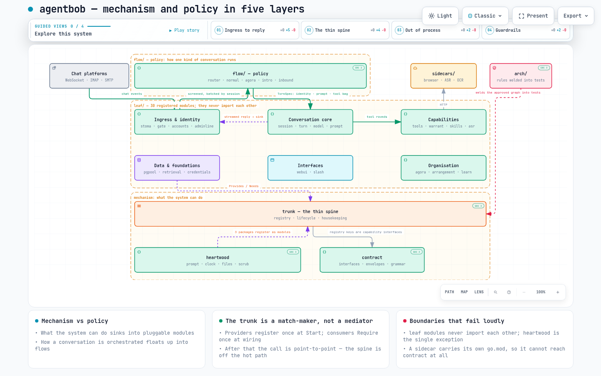

# agentbob

A self-hosted, IM-first AI agent — written from scratch in Go.

You run it on your own hardware, point it at your own models, and talk to it
from the chat apps you already use. It holds conversations, runs tools, keeps
memory across sessions, and can be organised into a small team of agents that
hand work to one another.

*Read this in [中文](README.zh.md).*

---

## What it does

**Talks to you where you already are.** Telegram, Feishu, Discord, email, and a
local console — all at once, through one gateway. Each platform is a plugin
behind a common source/sink contract, so adding another is a self-contained job.

**Runs on your models.** A model pool holds many backends at once, routes each
request by tags and health, keeps prompt-cache affinity so repeated context stays
warm, and backs off and retries a busy backend instead of failing the turn.
Local llama.cpp servers, hosted APIs, or a mix.

**Uses tools.** Shell execution, a sandboxed file store, web search and page
fetching, a real browser it can drive and log into, vision and OCR, speech
transcription, image generation, EPUB translation, WordPress publishing. Tools
are authorized per caller, not globally.

**Remembers.** Sessions persist in Postgres. Long conversations are compacted
rather than truncated; older material stays reachable through retrieval instead
of falling off the end.

**Can be a team, not just a bot.** The organisation layer lets you define
members with roles who each have their own inbox, skills, and identity. They
route work between themselves and report back, which is a different shape of
problem from one assistant answering one person.

**Is governed.** Authorization is a first-class module: a single policy source
decides what any given caller may do, with a decision log. There is no admin
back door — the gate is the only path.

**Exposes itself.** A gateway module can publish the model pool as an
API-key-authenticated endpoint, so other software can use the same backends
through bob.

---

## How it is built

Five layers, with a hard rule at the centre: **leaf modules never import each
other.** They reach one another only through capability interfaces obtained from
a thin spine.

```
contract     Capability interfaces + cross-module envelope data. Zero behaviour.
heartwood    Shared primitives every module may import directly (clock, file
             staging, prompt hygiene, credential scrubbing).
trunk        The spine: capability registry, lifecycle sequencer, housekeeping
             scheduler. Knows nothing about messages, sessions, or companies.
leaf/        Modules — behavioural subsystems with lifecycles and resources.
flow/        Flows — thin orchestration scripts, replaceable end to end.
```

The point of the split is that **mechanism and policy come apart**. What the
system *can do* lives in modules; how a particular kind of conversation is
*orchestrated* lives in a flow you can swap out whole.

**Interactive system maps.** Two of them, live in the browser — pan, zoom, search,
trace a relationship, step through guided views, export PNG/SVG:
[the five layers](https://hector918.github.io/agentBob-public/docs/diagrams/architecture-layers.en.html) ·
[the life of one message](https://hector918.github.io/agentBob-public/docs/diagrams/message-lifecycle.en.html)
*(中文：[五层结构](https://hector918.github.io/agentBob-public/docs/diagrams/architecture-layers.zh.html) ·
[一条消息的一生](https://hector918.github.io/agentBob-public/docs/diagrams/message-lifecycle.zh.html))*

[](https://hector918.github.io/agentBob-public/docs/diagrams/architecture-layers.en.html)

This is not an aspiration enforced by review discipline — it is enforced by
tests. The `arch/` package holds the approved module connection graph; any
module that gains or loses a dependency edge turns the build red until the
change is reviewed and approved there.

Dependency-heavy work (a browser engine, CUDA inference, the Python ecosystem)
lives in `sidecars/` — separate processes the main binary talks to over HTTP, so
they can be deployed onto different hardware without touching the core.

**→ Full documentation: [English](docs/en/architecture.md) · [中文](docs/zh/architecture.md) · [Diagrams](https://github.com/hector918/agentBob-public/tree/main/docs/diagrams)**

---

## How it got here

The project grew in recognisable phases.

It started as a core loop: a gateway to receive messages, a model pool to answer
them, a turn engine to drive tool use, and a store to make it all survive a
restart. Once that held, the question became whether one agent was the right
unit at all — which produced the organisation layer, where several members with
distinct roles and inboxes pass work between them, and a web console to see what
they were doing.

Reach came next: more chat platforms, email, OCR and vision so the agent could
read what people actually send, cross-entrypoint identity so the same person is
the same person whether they arrive by Telegram or by mail, and a skill system
for task-specific instructions.

By then the codebase had grown faster than its structure. Adding one feature
touched a dozen packages, wiring had collected in a single fat startup file, and
the differences between conversation types had spread into scattered
conditionals. That prompted a deliberate rebuild around the trunk/leaf/flow
architecture described above, along with a rewrite of the turn loop into one
core with interchangeable drivers.

Since the rebuild the work has been depth rather than breadth: a richer tool
surface, browser automation with persistent logins, an experience optimiser that
tunes its own prompts against real transcripts, task orchestration, an outward
API gateway — and repeated whole-project reviews, which is where a fair number
of the design decisions recorded in the docs came from.

---

## Who wrote it

Built by [hector918](https://github.com/hector918), using
[hermes-agent](https://github.com/NousResearch/hermes-agent) as a design
blueprint for the agent loop.

Licensed under the terms in [LICENSE](LICENSE).

---

## Quick start

Requirements: Docker with the compose plugin, a reachable Postgres, and at
least one OpenAI-compatible model endpoint.

```bash
git clone <this-repo> agentbob
cd agentbob
docker compose build           # ~5-8 min first time (downloads chromium)
docker compose up -d
docker compose logs -f bob
```

Then configure `$BOB_HOME`:

```bash
# .env — secrets. BOB_POSTGRES_DSN is REQUIRED; bob refuses to boot without it
# (compose does not bundle a database — supply your own).
BOB_POSTGRES_DSN=postgres://user:pass@<db-host>:5432/bob?sslmode=disable
TELEGRAM_BOT_TOKEN=<token-from-BotFather>
```

```yaml
# models.yaml — where your models live. Use a LAN IP, not host.docker.internal
# (that does not work on Linux).
entries:
  - name: smart
    provider: llama-cpp
    model: <your-model-id>
    base_url: http://<model-host>:11434/v1
    tags: [smart, local, toolcall]
```

Chat access is **closed by default** — the seeded `sources/telegram.yaml` drops
every message until you add yourself to `allowlist`. This is deliberate; an open
bot on a public platform is an open shell.

Platform support is architecture-portable: tested on macOS arm64, Linux amd64,
and Linux arm64 (Raspberry Pi 5, Graviton). Built images are CPU-specific — build
on the target, or use `buildx` for a multi-arch image.

**Full deployment guide, including a from-scratch Linux server walkthrough and
state migration: [English](docs/en/deployment.md) · [中文](docs/zh/deployment.md)**

---

## Commands

Two kinds: CLI subcommands (`bob <cmd>`) and slash commands typed into a chat
(`/<cmd>`). Slash commands run directly in bob and never wake the model. See
[commands.md](commands.md).
