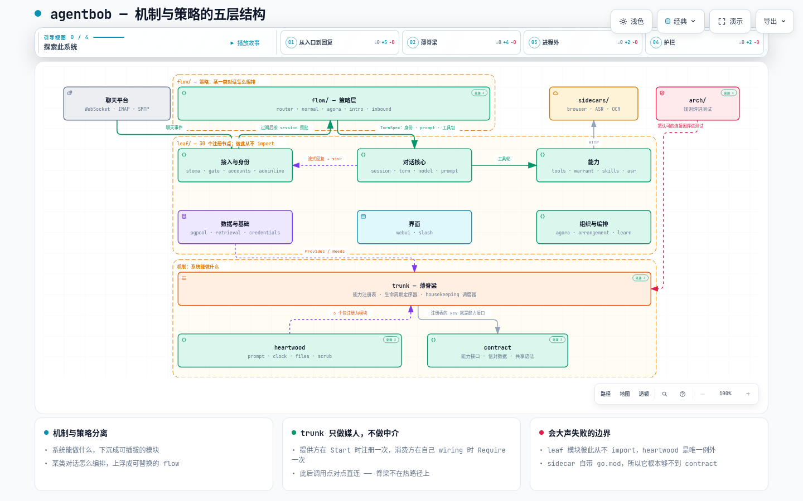

# 架构总览

agentbob 是一个自托管的、以即时通讯为第一入口的 AI agent，用 Go 从零写成。它同时接入多个聊天平台，把每一条进来的消息解析成一个「回合」（turn），在回合里调用模型、执行工具、写回结果。

整个代码库围绕一条原则组织：**机制与策略分离**。「能做什么」下沉成可插拔的模块，「某种对话怎么编排」上浮成可整条替换的流程。改行为等于加一条流程，机制不动。

> **可交互图** — [机制与策略的五层结构](../diagrams/architecture-layers.zh.html) · [English](../diagrams/architecture-layers.en.html)
> 一份自包含 HTML 系统图：五层、模块分组、主干接线，带引导视图、搜索、关系追踪与 PNG/SVG 导出。
> 节点上的证据链接指回固定版本下的真实文件。本地打开即可；若仓库开了 GitHub Pages 也能直接访问——
> 在 github.com 上直接点 `.html` 链接看到的是源码而不是页面。

[](../diagrams/architecture-layers.zh.html)

---

## 五层

```
contract     契约层：能力接口 + 跨模块信封数据，外加一小组共享语法函数。
             谁都可以 import 它，它不 import 任何本项目的包。
     ↑
heartwood    共享基础原语：进程时钟、附件暂存、提示词构建、凭证脱敏。
             唯一允许被所有模块直接 import 的实现层。其中三个包
             同时注册为 trunk 模块——工具直接 import，生命周期走 trunk。
     ↑
trunk        薄脊梁：能力注册表、生命周期定序器、housekeeping 调度器。
             对具体业务零知识——不认识消息、会话、公司。
     ↑
leaf/        模块：有生命周期和资源的行为子系统。
             模块之间零 import，只经 trunk 取得彼此的能力接口。
     ↑
flow/        流程：薄编排脚本，按对话类型选取，可整条替换。
```

另有 `sidecars/`——跑在独立进程或容器里的重依赖服务（浏览器引擎、语音转写、OCR、检索）。这条边界同时是**编译期**边界：sidecar 自带 `go.mod`，够不着 `contract` 和 `heartwood`，主进程只通过 HTTP 与之对话。

聊天平台连接不走这条路——各 source 直接持有对第三方平台的长连接（WebSocket、IMAP、SMTP），带自己的重连与至少一次语义。系统里大部分活跃度相关的复杂性来自那里，而不是 sidecar。

---

## trunk：脊梁做什么

`trunk` 只提供三样东西，且都是 content-free 的：

**能力注册表**（`10-registry.go`）——把「接口类型」映射到「唯一实现」。提供方在 `Start` 期间注册一次，消费方在自己的 wiring 里 `Require` 一次，拿到引用后自己持有、点对点直调。**trunk 是媒人，不是中介**：它不在每次调用的热路径上。

**生命周期定序器**（`20-lifecycle.go`）——从每个模块声明的 `Provides` / `Needs` 建依赖图，拓扑排序后按序 `Start`、逆序 `Stop`，启动期检测环、缺失的提供方和重复注册。

**housekeeping 调度器**（`30-housekeeping.go`）——一个单 worker 排空优先级队列，跑周期性的持久化维护任务（数据库清理、磁盘扫除）。模块用 `TryRequire[Housekeeper]` 懒加入，而不是各自转一个定时器，于是所有重扫除集中在一处协调。分界线是**落不落盘**：碰持久状态的扫除归 housekeeper，纯内存的卫生工作留在模块内自己转 ticker。

关于启动，有一点容易被名字误导：**`Optional()` 不是"可有可无"**，它是一条对消费方的契约——消费方必须把这个能力挂在软边上，并把「拿不到」当作合法状态处理，于是提供方启动失败时系统降级而不是拒绝启动。至于"降级"具体是什么，由各模块自己定义，而且刻意各不相同：授权模块缺席时**仍然在场**，只是把矩阵设成全拒（结果是零工具可用）；组织模块缺席则是真正的 fail-open（没有组织就不走组织流程，其余照常）。安全相关的那些一律往严的方向解释——凭空消失是不行的，因为消失会让上游"开门放行"。

反过来，`pgpool` / `slash` / `claimtoken` 这类是非 optional 的：它们不在，就没有任何东西能工作。

第四个机制——异步信号总线——设计中留了位置，尚未实现。同步的回合生命周期钩子**不是** trunk 的事，归 turn 和 flow 模块。

---

## contract：什么才配进来

`contract` 是一个刻意保持扁平的单包（内部引用密度高，拆子包会起 import 环）。一个类型进 `contract` 的**唯一**理由是它属于「经 trunk 中介」的合同：

1. 一个注册到 trunk 的能力接口——也就是注册表的 key，消费方靠它替代直接 import 提供方；
2. 出现在这种接口方法签名里的载荷数据——流过 trunk 中介调用的通用信封（消息、附件、工具调用、模型响应之类）。

还有一类刻意的例外，值得单独说，因为它和"零行为"的印象冲突：**共享语法**。`ScopeFor` / `TargetForScope` / `SplitMemberSubScope` 是纯函数，住在 contract 里不是因为它们出现在某个签名里，而是因为「作用域字符串怎么拼、怎么拆」必须只有一份写法——会话解析器和收件箱路由各写一份的话，它们迟早会漂开。同理还有少数跨层 sentinel（例如把「队列满、可重试」和「后端挂了」区分开的那个错误值）：说这句话的是面向用户的措辞层，和产生它的池不在同一层，所以这个值必须在两边都够得着的地方。

其余一律留在外面。只被一个模块用、且不出现在任何 contract 接口签名里的类型留在那个模块里，哪怕它"只是个 struct"。**直接耦合**（插件与父模块，比如一个 source 和 gateway）的共享类型留在拥有它的一方，另一方直接 import——直接引用不配进 contract。

## heartwood：唯一的直接 import 例外

leaf 模块之间零 import 是硬规则。`heartwood` 是唯一的例外层：任何 leaf 或 flow 都可以直接 import 它。

准入门槛因此很高——成员必须是真正共享、无向上依赖、且**必须处处行为完全一致**的原语。当前四个：

| 包 | 为什么必须处处一致 |
|---|---|
| `prompt` | `SanitizeSpeaker` 是同一套 `"[name]:"` 注入防御；`EstTokens` 的字节计数必须让压缩逻辑和模型池算出同一个数 |
| `clock` | 用数据库权威时间校准的进程时钟；多主机写同一个库时需要单一时间标尺 |
| `files` | 沙箱文件存储与入站附件暂存，共享的文件系统原语 |
| `scrub` | 凭证脱敏防线，任何路径上的脱敏结果必须逐字节相同 |

它**不是**单消费者辅助函数的收容所，也不放带重外部依赖（ffmpeg、网络后端）的子系统。

这层还有个双重身份：`prompt`、`clock` 以及 `files` 的清扫器**各自注册为一个 trunk 模块**。也就是说工具本身是直接 import 的，而它们的生命周期照样归 trunk 编排——「住在 heartwood」和「是一个模块」并不互斥。

准入门槛高是有代价的，值得诚实写出来：**过不了这道门的东西只能被镜像，不能被共享**。凭证脱敏在 `sidecars/browser` 里有一份手抄副本（sidecar 是独立 Go module，根本 import 不到 `heartwood`）；失败快照的环形文件存储在 `tools`、`skills`、`agora` 里各有一份逐字节相同的实现（leaf 之间不许互相 import，而这种文件系统机制又不该进 contract）。这些重复不是疏忽，是规则的账单——所以其中每一处都有测试盯着，不许漂移。

## arch：把规则焊成测试

`arch/` 包不含任何产品代码，它是上述架构规则的**机器守卫**——十来个测试函数，分几类：

- **连接图**：`wantGraph` 是已批准的模块连接图。任何模块增减一条 `Provides` / `Needs` 边，或模块本身增删，测试立刻变红。红色就是目的：一条新的跨模块连接必须先在这里被 review 和批准才能上线。`wantOptional` 是 `TryRequire` 软边的对应台账——软边对 `wantGraph` 不可见，在有这个测试之前它们只活在一份手写注释里，然后悄悄烂掉。
- **动态提供**：`wantProvides` 扫的是真实的 `trunk.Provide[...]` 调用点，因此能看见那些**运行时才决定发布**、靠反射读 `Provides()` 根本看不到的能力。它同时把「提供了却从来没人消费」的死线变成构建失败。
- **准入与边界**：`heartwoodAllowed` 挡住随手往 `heartwood/` 加包；import 边界测试确保 leaf 之间不互相 import；还有一个测试强制脱敏模块与它在 sidecar 里的副本逐字节相同。
- **启动顺序**：有几条约束表达不成硬 `Needs`（因为它们是软边），于是直接由测试扫描真实的注册序列来钉住。
- **命名约定**：懒解析包装必须叫 `lazy*`，否则一条软边就能绕过上面那道审批闸。

---

## 模块地图

**30 个注册节点**，按职能分组。注意"注册节点"不等于"`leaf/` 下的目录"——流程也注册，`heartwood/` 里有三个包也注册：

**接入与身份** — `stoma`（多平台网关与各 source 插件）· `gate`（准入与筛查）· `inbound`（进程边缘分流）· `accounts`（跨入口身份）· `claimtoken`（认领令牌）· `adminline`（管理通道）

**对话核心** — `session`（会话生命周期与消息存储）· `turn`（回合驱动、工具轮次、压缩、打捞）· `model`（模型池、选路、亲和、用量）· `modelgate`（对外 API 网关）· `prompt`（系统提示词构建器）

**能力** — `tools`（工具目录与通道池，浏览器接管也由它发布）· `warrant`（授权、本地/远程执行、空间）· `skills`（技能目录）· `asr`（语音转写）

**组织与编排** — `agora`（多成员组织、收件箱路由、投递）· `arrangement`（任务编排）· `learn`（经验优化器）

**数据与基础** — `pgpool`（数据库连接，整张依赖图的根）· `retrieval`（冷记忆检索）· `urllib`（共享 URL 记忆）· `credentials`（凭证代理）· `clock`（校准时钟）· `files-sweeper`（附件清扫）

**界面** — `webui`（面板与控制台）· `slash`（斜杠命令注册表）

**流程** — `flow-router` · `flow-normal` · `flow-agora` · `flow-intro`

浏览器是个容易误会的点：**没有 `leaf/browser` 这个模块**。浏览器引擎住在 sidecar 里，主进程侧的能力由 `tools` 发布（而且是运行时按配置动态发布的，所以在静态的连接图里看不见），控制台那侧的接管入口由 `webui` 提供。

同样值得提醒：**连接图上没有的边不代表没有耦合**。`wantGraph` 只画硬 `Needs`，软边（`TryRequire`）另有台账。只看硬边会严重低估某些模块的实际连接度——`modelgate` 硬边只有一条「模型池」，但它的鉴权整个挂在软边上。

各模块详情见 [modules/](modules/)，流程层见 [flows.md](flows.md)。

---

## 目录导航

| 文档 | 内容 |
|---|---|
| [core/trunk.md](core/trunk.md) | 脊梁三机制的实现 |
| [core/contract.md](core/contract.md) | 能力接口清单与信封数据 |
| [core/heartwood.md](core/heartwood.md) | 四个共享原语 |
| [core/infra.md](core/infra.md) | 入口、配置、i18n、日志、迁移、架构守卫 |
| [modules/](modules/) | 各行为模块 |
| [flows.md](flows.md) | 流程层：router / normal / agora / intro / inbound / compose |
| [sidecars/](sidecars/) | 独立进程服务 |
